# ggplot2 cheatsheet


```r
opts_chunk$set(warning=FALSE)
```

## Loading ggplot


```r
library(ggplot2)
```

```
## Loading required package: methods
```

## Loading sample data


```r
set.seed(1410)  # make the sample reproducible
head(diamonds)
```

```
##   carat       cut color clarity depth table price    x    y    z
## 1  0.23     Ideal     E     SI2  61.5    55   326 3.95 3.98 2.43
## 2  0.21   Premium     E     SI1  59.8    61   326 3.89 3.84 2.31
## 3  0.23      Good     E     VS1  56.9    65   327 4.05 4.07 2.31
## 4  0.29   Premium     I     VS2  62.4    58   334 4.20 4.23 2.63
## 5  0.31      Good     J     SI2  63.3    58   335 4.34 4.35 2.75
## 6  0.24 Very Good     J    VVS2  62.8    57   336 3.94 3.96 2.48
```

```r
dsmall <- diamonds[sample(nrow(diamonds), 100), ]
```

## Basic use (qplot)


```r
qplot(carat, price, data=diamonds)
```

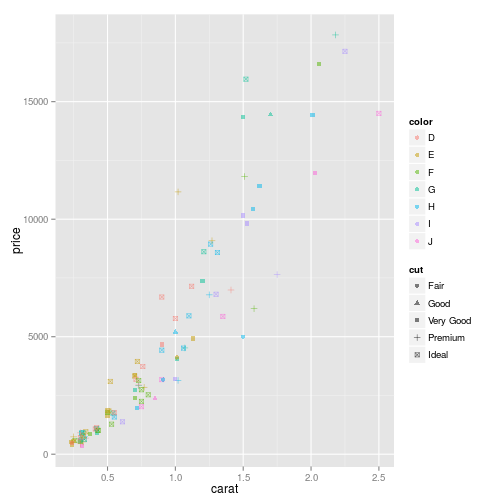 

## Color, size, shape and other aesthetic attributes


```r
qplot(carat, price, data=dsmall, color=color, shape=cut, alpha=I(1/2))
```

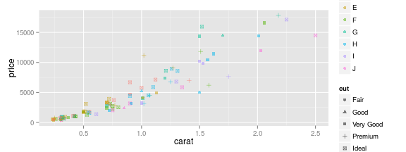 

## Plot geoms


```r
qplot(carat, price, data=dsmall, geom=c("point", "smooth"))
```

```
## geom_smooth: method="auto" and size of largest group is <1000, so using loess. Use 'method = x' to change the smoothing method.
```

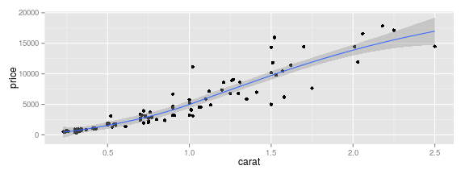 

### Adding a smoother
There are many different smoother that can be used with `method` argument.


```r
qplot(carat, price, data=dsmall, geom=c("point", "smooth"), method="lm")
```

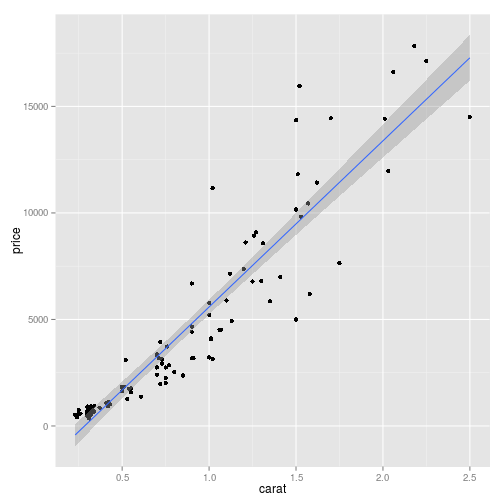 

### Boxplots and jittered points


```r
qplot(color, price/carat, data=diamonds, geom="jitter")
```

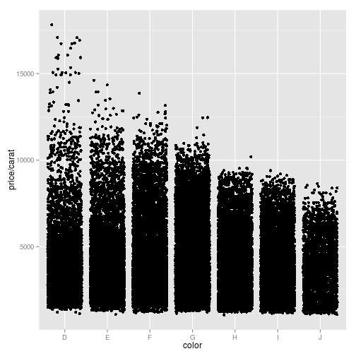 


```r
qplot(color, price/carat, data=diamonds, geom="boxplot")
```

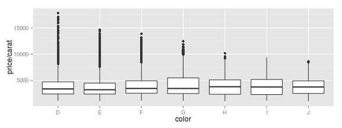 

### Histogram and density plots


```r
qplot(carat, data=diamonds, geom="histogram", fill=color)
```

```
## stat_bin: binwidth defaulted to range/30. Use 'binwidth = x' to adjust this.
```

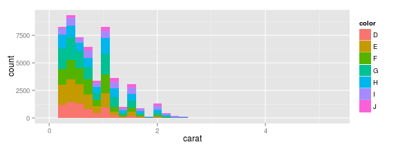 


```r
qplot(carat, data=diamonds, geom="density", color=color)
```

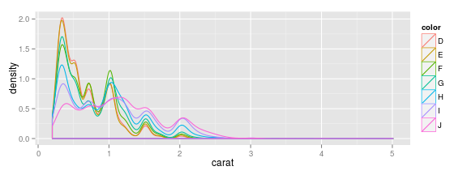 

Change the amount of smoothing with `binwidth` argument.


```r
qplot(carat, data=diamonds, geom="histogram", binwidth=1)
```

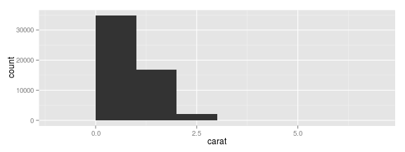 

```r
qplot(carat, data=diamonds, geom="histogram", binwidth=0.1)
```

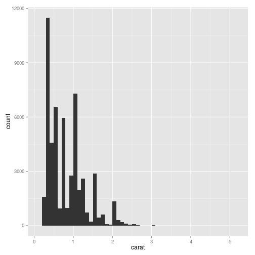 

```r
qplot(carat, data=diamonds, geom="histogram", binwidth=0.01)
```

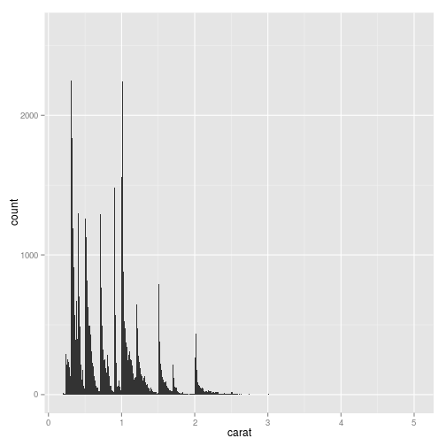 

### Bar charts


```r
qplot(color, data=diamonds, geom="bar")
```

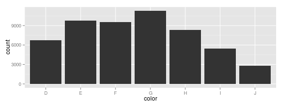 


```r
# bar plot of diamond color weighted by carat
qplot(color, data=diamonds, geom="bar", weight=carat) +
    scale_y_continuous("carat")
```

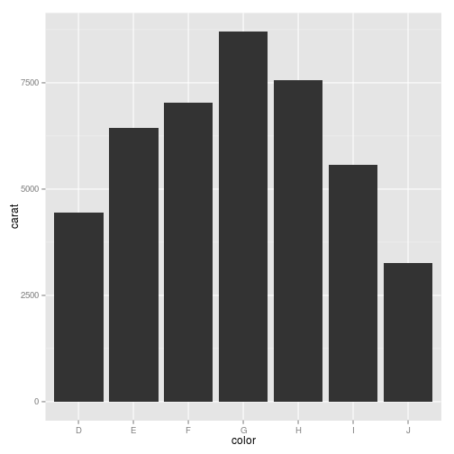 

### Time series


```r
head(economics)
```

```
##         date   pce    pop psavert uempmed unemploy
## 1 1967-06-30 507.8 198712     9.8     4.5     2944
## 2 1967-07-31 510.9 198911     9.8     4.7     2945
## 3 1967-08-31 516.7 199113     9.0     4.6     2958
## 4 1967-09-30 513.3 199311     9.8     4.9     3143
## 5 1967-10-31 518.5 199498     9.7     4.7     3066
## 6 1967-11-30 526.2 199657     9.4     4.8     3018
```


```r
qplot(date, unemploy/pop, data=economics, geom="line")
```

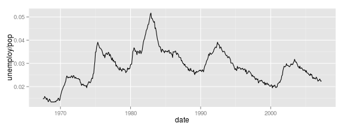 

### Faceting


```r
qplot(carat, data=diamonds, facets=color~.,
      geom="histogram", binwidth=0.1, xlim=c(0,3))
```

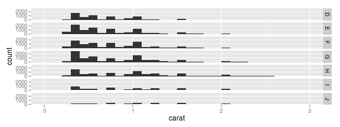 

### Other options
- `xlim` and `ylim`: set limits for x- and y-axis (e.g. `xlim=c(0,20)`)
- `main`: main title for the plot
- `xlab` and `ylab`: labels for x- and y-axis


```r
qplot(carat, price, data=dsmall,
      xlab="Price ($)",
      ylab="Weight (carats)",
      main="Price-weight relationship")
```

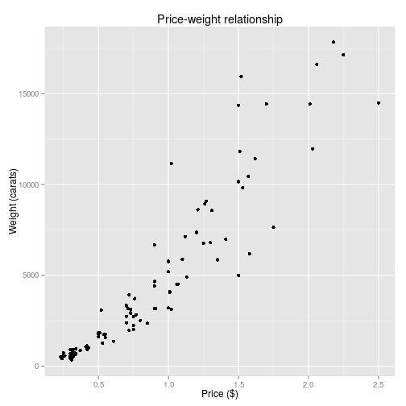 
