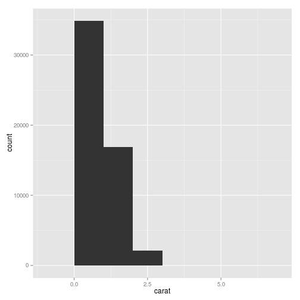

# ggplot2 cheatsheet

## Loading ggplot


```r
library(ggplot2)
```

```
## Loading required package: methods
```

## Loading sample data


```r
set.seed(1410)  # make the sample reproducible
head(diamonds)
```

```
##   carat       cut color clarity depth table price    x    y    z
## 1  0.23     Ideal     E     SI2  61.5    55   326 3.95 3.98 2.43
## 2  0.21   Premium     E     SI1  59.8    61   326 3.89 3.84 2.31
## 3  0.23      Good     E     VS1  56.9    65   327 4.05 4.07 2.31
## 4  0.29   Premium     I     VS2  62.4    58   334 4.20 4.23 2.63
## 5  0.31      Good     J     SI2  63.3    58   335 4.34 4.35 2.75
## 6  0.24 Very Good     J    VVS2  62.8    57   336 3.94 3.96 2.48
```

```r
dsmall <- diamonds[sample(nrow(diamonds), 100), ]
```

## Basic use (qplot)


```r
qplot(carat, price, data=diamonds)
```

 

## Color, size, shape and other aesthetic attributes


```r
qplot(carat, price, data=dsmall, color=color, shape=cut, alpha=I(1/2))
```

 

## Plot geoms


```r
qplot(carat, price, data=dsmall, geom=c("point", "smooth"))
```

```
## geom_smooth: method="auto" and size of largest group is <1000, so using loess. Use 'method = x' to change the smoothing method.
```

 

### Adding a smoother
There are many different smoother that can be used with `method` argument.


```r
qplot(carat, price, data=dsmall, geom=c("point", "smooth"), method="lm")
```

 

### Boxplots and jittered points


```r
qplot(color, price/carat, data=diamonds, geom="jitter")
```

 


```r
qplot(color, price/carat, data=diamonds, geom="boxplot")
```

 

### Histogram and density plots


```r
qplot(carat, data=diamonds, geom="histogram")
```

```
## stat_bin: binwidth defaulted to range/30. Use 'binwidth = x' to adjust this.
```

 


```r
qplot(carat, data=diamonds, geom="density")
```

 

Change the amount of smoothing with `binwidth` argument.


```r
qplot(carat, data=diamonds, geom="histogram", binwidth=1)
```

 

```r
qplot(carat, data=diamonds, geom="histogram", binwidth=0.1)
```

 

```r
qplot(carat, data=diamonds, geom="histogram", binwidth=0.01)
```

```
## Warning: position_stack requires constant width: output may be incorrect
```

 
